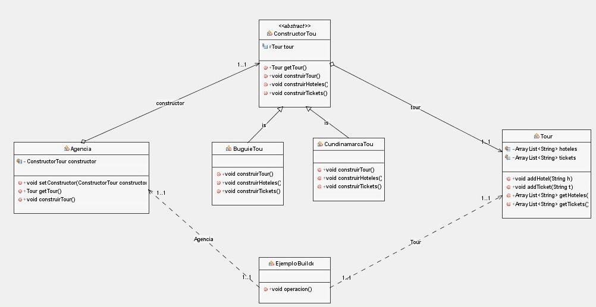
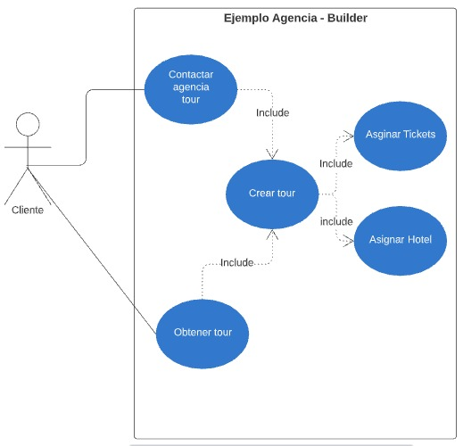
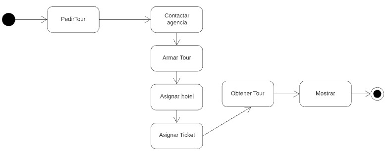
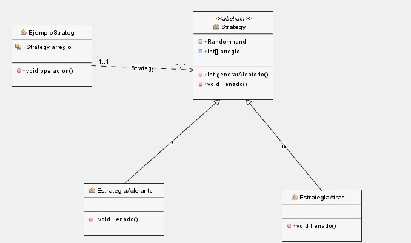
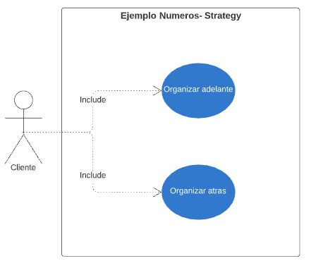
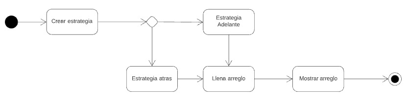

# Analisis de Patrones de diseño
## **Integrantes :**
 

* ### **Kevin Duvan Bernal Ortiz - 20181020066**
* ### **Jonathan Steven Cruz Monroy - 20181020064**
* ### **Johan Andres Aguirre Diaz - 20181020072**
 

## **Objetivo**
 

* ### Teniendo  en cuenta los patrones de diseño del repositorio https://github.com/apdaza/patrones-gof-python.git se busca desarrollar los diagramas  de :
    + #### Clases
    + #### Casos de usos
    + #### De Actividades   
 

###   Los patrones de diseño seleccionados para nuestro caso fueron :
+ Patron Builder
+ Patron Strategy

 

## **Analisis Para el Patron Builder**    
 

### **Diagrama de Clases**  
 

  

  
 

### **Digrama de Casos de Usos**
 

  
 

### **Digrama  de Actividades**  
 

 

## **Analisis Para el Patron Strategy**
 

### **Diagrama de Clases**
 

 

### **Digrama de Casos de Usos**
 

  
 

### **Digrama  de Actividades**  

 

